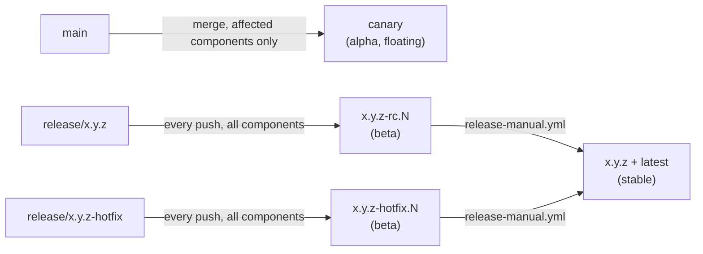
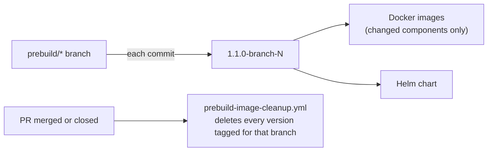

# CI/CD and Releases

This page is the map for the repo's CI/CD flow: prebuild artifacts, the `canary` main tag, RC/hotfix tags, and final releases.

## The Release Ladder

Every image and Helm chart carries the same tag, so a build's provenance and stability are visible at a glance:

| Tag | Stage | Created from | Meaning |
| --- | --- | --- | --- |
| `canary` | Alpha | every merge to `main` | Floating tag, always the latest main. Overwritten on each merge — never pin to it. |
| `x.y.z-rc.N` | Beta | every push to `release/x.y.z` | Release candidate. Immutable. |
| `x.y.z-hotfix.N` | Beta (patch) | every push to `release/x.y.z-hotfix` | Hotfix candidate for an already-released version. Immutable. |
| `x.y.z` | Stable | `release-manual.yml` | Production release. Also tagged `latest`. Immutable. |

Chart version and image tag always match — there is no separate chart-only version. A chart-only fix rides the next tag like any other change.

## Artifact Locations

| Artifact type | Flow | Registry path |
| --- | --- | --- |
| Docker images | all release and prebuild flows | `ghcr.io/caipe-io/<image>` |
| Helm charts | all release and prebuild flows | `ghcr.io/caipe-io/charts` |

## PR Flow

`pr-version-bump.yml` runs on every PR targeting `main` or `release/**`. It no longer bumps version files or commits to ordinary PR branches — that used to happen on every PR and produced noisy, uncommitted-looking diffs for no reason, since prebuild and canary tags are computed at build time from git tags instead.

It does three things:

1. Checks whether the PR branch contains the latest base branch and whether GitHub reports merge conflicts, posting an update comment and failing the check if not.
2. Applies a PR flow label such as `dev`, `0.4.0`, `0.4.0-hotfix`, or `release/0.4.0`.
3. For a `release/x.y.z -> main` PR specifically, uses `.github/actions/prepare-release/action.yml` to commit the final `x.y.z` version files and changelog onto that PR branch ahead of merge.

## Docker Image CI

The main image workflows (`ci-caipe-ui.yml`, `ci-dynamic-agents.yml`, `ci-mcp-servers.yml`, `ci-rag.yml`, `ci-audit-service.yml`, `ci-skill-scanner.yml`, `ci-slack-bot.yml`, `ci-webex-bot.yml`, `ci-keycloak-init.yml`, `ci-openfga-authz-bridge.yml`, `ci-agentgateway-config-bridge.yml`, `ci-autonomous-agents.yml`, `ci-scheduler.yml`) and `ci-helm.yml` for the Helm chart all trigger on two ref shapes:

- **Push to `main`** — builds `canary`, but only for the component(s) whose own paths actually changed in that push. A docs-only or single-component merge does not rebuild everything.
- **Push of a tag** (`x.y.z`, `x.y.z-rc.N`, `x.y.z-hotfix.N`) — builds every component fresh, regardless of which paths changed. This is what makes an RC or final release a complete, reproducible artifact set.

Each workflow resolves the tag through `.github/actions/determine-release-tag/action.yml`, which returns `canary` for a main push, the pushed tag for a tag push, or the manual input for `workflow_dispatch`.

## Prebuild Artifacts

Prebuild artifacts are temporary test artifacts published from PRs before merge.

Use prebuilds when you want to test Docker images or Helm charts without waiting for a branch merge and official tag.

1. Create a branch called `prebuild/*`, for example `prebuild/feat/add-feature-a`.
2. Open a PR from the prebuild branch to the intended target branch.
3. Each `prebuild-*.yml` workflow triggers directly off that PR and publishes only the component(s) whose paths changed, tagged `<latest-stable-tag>-<branch>-<N>` — for example `1.1.0-feat-add-feature-a-3`, where `1.1.0` is the latest stable release and `3` is the commit count on the branch.
4. Each new commit to the prebuild branch increments `N` and publishes a new tag.
5. Use the prebuild artifacts for testing.
6. Upon PR merge or closure, all prebuild artifacts with that branch's tags are automatically deleted by `prebuild-image-cleanup.yml`.

## Release Candidate Flow

Use a `release/x.y.z` branch when preparing a new release.

1. Create or update the release branch.
2. Open PRs targeting `release/x.y.z` and merge them.
3. `auto-tag.yml` creates tag `x.y.z-rc.N` on every push to the branch.
4. The tag push triggers Docker and Helm CI for every component.
5. Test the published RC artifacts from GHCR.

## Final Release Flow

Final releases use plain `x.y.z` tags and are always cut manually.

1. Open a PR from `release/x.y.z` to `main`.
2. `pr-version-bump.yml` detects the release merge PR and commits the final version files and changelog onto that PR branch.
3. Merge the release PR to `main`.
4. `auto-tag.yml` detects the release branch merge and dispatches `release-manual.yml`.
5. `release-manual.yml` validates the version — it must be a plain semver or an RC, and strictly greater than the latest existing stable tag — then creates the final tag, pushes it, and creates a draft GitHub Release.
6. The final tag triggers Docker image and Helm chart CI for every component.
7. CI workflows notify `release-finalize.yml` as they complete.
8. `release-finalize.yml` publishes the draft release after all required CI workflows pass.

After publishing, `release-finalize.yml` also dispatches post-release security scanning and quick sanity integration tests, and cleans up old RC tags whose base version is older than the newly published release.

If one or more required CI workflows fail, the GitHub Release remains in draft state and receives a failure note for investigation.

## Hotfix Flow

Use a `release/x.y.z-hotfix` branch when patching an already released version. The flow mirrors release candidates:

1. Create `release/x.y.z-hotfix`.
2. Open PRs targeting the hotfix branch and merge approved fixes.
3. `auto-tag.yml` creates `x.y.z-hotfix.N` on every push.
4. The tag push triggers Docker and Helm CI for every component.

When ready to publish the fixed version, run the final release flow with the intended final semver tag.

## Useful Workflow Reference

| Workflow or action | Responsibility |
| --- | --- |
| `.github/workflows/pr-version-bump.yml` | PR labels, branch freshness checks, release/*→main version preparation |
| `.github/workflows/auto-tag.yml` | Detects release-branch merges to main; creates `-rc.N`/`-hotfix.N` tags on release branch pushes |
| `.github/workflows/release-manual.yml` | Validates and creates the final `x.y.z` tag and draft GitHub Release |
| `.github/workflows/release-prerelease.yml` | Manually cuts an `-rc.N`/`-hotfix.N` tag on demand |
| `.github/workflows/release-finalize.yml` | Publishes draft release after required CI workflows pass |
| `.github/workflows/ci-*.yml` | Publishes `canary` on main pushes, and every tag on tag pushes |
| `.github/workflows/ci-helm.yml` | Publishes the Helm chart the same way |
| `.github/workflows/prebuild-*.yml` | Publishes temporary prebuild images and charts for PR testing |
| `.github/actions/prebuild-version/action.yml` | Computes `<latest-stable-tag>-<branch>-<N>` for prebuild builds |
| `.github/actions/validate-release-tag/action.yml` | Enforces the semver/RC format and monotonicity rules on manual release tags |
| `.github/actions/update-version-files/action.yml` | Sets version + appVersion + local dependency refs across pyproject, lockfile, and every chart |
| `.github/actions/determine-release-tag/action.yml` | Resolves the tag used by image and chart CI workflows (`canary`, a pushed tag, or a manual input) |
| `.github/actions/prepare-release/action.yml` | Updates final release files and generates changelog |

## Troubleshooting

If a PR check fails with a branch update comment, merge the latest target branch into the PR branch and push again.

If a `canary` build did not pick up your change, check whether your component's own paths actually changed in that push — a main push only rebuilds affected components, not everything.

If a final release stays as a draft, inspect the required CI workflows listed in `release-finalize.yml`. The release is published only after all required workflows pass or are skipped successfully.
